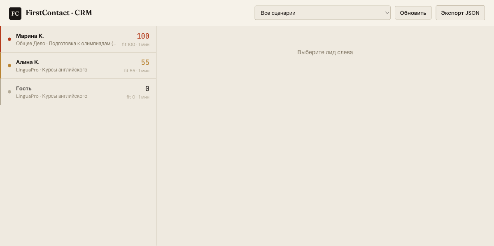
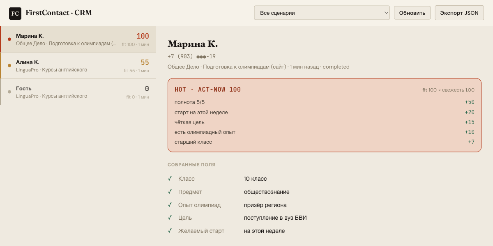
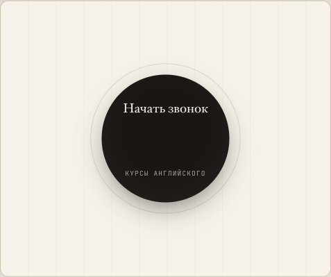

# FirstContact — AI-First стартап (заявка JMLC)

**FirstContact** — голосовой AI-агент и CRM, которые берут на себя **первый контакт**
с заявками онлайн-школ: агент звонит, голосом в реальном времени выясняет класс, цель
и сроки, оценивает заявку и передаёт менеджеру. Продукт развёрнут, есть платящие
клиенты; выходим на рынок США.

Этот репозиторий — **сдача на JMLC**: он показывает и продукт (AI-First стартап), и
один ML-эксперимент внутри него — пример того, как мы принимаем решения по машинному
обучению строго и по делу.

---

## 📄 Документы

GitHub показывает HTML как исходник — чтобы открыть **как страницу**, жми «render»
(или скачай файл и открой в браузере).

| Документ | Открыть |
|---|---|
| **Краткое описание проекта** (3 страницы) — продукт, эксперимент, закрытие критериев | [render](https://htmlpreview.github.io/?https://github.com/WladyslawKudinov/jmlc-firstcontact/blob/main/docs/project_summary_ru.html) · [исходник](docs/project_summary_ru.html) |
| **Слайды** для устной защиты | [render](https://htmlpreview.github.io/?https://github.com/WladyslawKudinov/jmlc-firstcontact/blob/main/docs/slides_ru.html) · [исходник](docs/slides_ru.html) |
| Карта архитектуры продукта | [render](https://htmlpreview.github.io/?https://github.com/WladyslawKudinov/jmlc-firstcontact/blob/main/docs/product/architecture-map.html) · [исходник](docs/product/architecture-map.html) |

---

## 🗂 Структура

```
jmlc-firstcontact/
├── docs/                  краткое описание, слайды, скрины и архитектура продукта
├── research/              ML-эксперимент: пайплайн, ноутбук, тесты (этот код запускается)
└── product/voice-mvp/     код системы — публичный FCPrototype (git submodule)
```

> Боевой прод (телефония, ключи, клиентские данные) — в **приватных** репозиториях;
> здесь он показан архитектурой и скриншотами, а как **читаемый код системы** приложен
> публичный voice-MVP (`product/voice-mvp`).

Подтянуть код системы:
```bash
git submodule update --init --recursive
```

---

## 🧪 Эксперимент в одном абзаце

Агент обзванивает поток заявок, а менеджер успевает перезвонить лишь части. **Кому
звонить первым?** Сравниваем три подхода на одних выборках: обученную модель на тексте
звонка, простые правила из прода и оценку заявки через LLM. Главный вопрос — не «чей
AUC выше на симуляции», а **переносится ли сигнал на реальные звонки**.

| Подход (AUC) | Симуляция | Реальные звонки (N=31) |
|---|:--:|:--:|
| Обученная модель (текст) | 0.67 | **0.39** ⬇ |
| Простые правила | 0.64 | **0.66** |
| Правила на полях, извлечённых нейросетью | — | **0.76** |
| Оценка заявки через LLM (что в проде) | — | **0.80** |

**Вывод:** обученная модель цеплялась за манеру речи генератора (*как* сказано) и на
реальных звонках развалилась — мы решили её **не катить**, и реальный тест подтвердил,
что решение верное. Правила и LLM читают **факты** (*что* сказано) и переносятся.
Ранжирование обзвона по LLM-оценке даёт **~83% будущих покупателей** в первых 20%
очереди против 48% при случайном порядке — **1.7× продаж** за тот же час менеджера.

Полная история и метод — в [кратком описании](docs/project_summary_ru.html) и
[`research/`](research/).

---

## ✅ Как закрываются критерии

- **Разработка и инженерия** — развёрнутый продукт (realtime-голос, телефония, БД,
  CRM); прод на Python/FastAPI в **Docker** на сервере; ML-репо с пайплайном одной
  командой, **CI** (GitHub Actions), **MLflow**, 59 автотестов (+ свой `Dockerfile`).
- **Data Science** — анти-утечка by design, EDA и предобработка, выбор и калибровка
  модели, метрики ранжирования (precision@k, NDCG), валидация слоями с доверительными
  интервалами.
- **Применение ИИ** — разработка с **AI-агентами** (Claude Code, superpowers, spec-kit);
  LLM как генератор данных без утечки **и** рабочий оцениватель заявок в проде.
- **Продуктовое мышление** — задача от выручки, MVP с платящими клиентами, измеренный
  импакт (1.7×), осознанное решение «не катить».

---

## 🖥 Продукт

CRM: список заявок и карточки горячих/холодных лидов; экран живого звонка.







Читаемый код системы — в [`product/voice-mvp`](product/voice-mvp) (публичный
FCPrototype: Node/Express, realtime-голос через WebSocket, телефония). Боевой прод
(Python/FastAPI, async SQLAlchemy + Alembic, Postgres, Docker + docker-compose) —
приватный.

---

## ▶️ Запуск ML-эксперимента

```bash
cd research
make setup       # зависимости
make report      # офлайн-отчёт без ключа (детерминированная заглушка вместо LLM)
# полный прогон с LLM:
make data && make train && make eval
make test        # 59 тестов
```

Либо в Docker:
```bash
cd research && docker build -t jmlc . && docker run --rm jmlc   # прогон тестов
```

---

## 🔒 Честность данных

Синтетические данные **всегда** помечены как синтетические и никогда не выдаются за
реальные. Набор реальных звонков собран на живом агенте и описан с его настоящим
размером (**N=31**) и способом разметки. Подробнее — в `research/CLAUDE.md` и
`research/docs/RESEARCH_LOG.md`.
