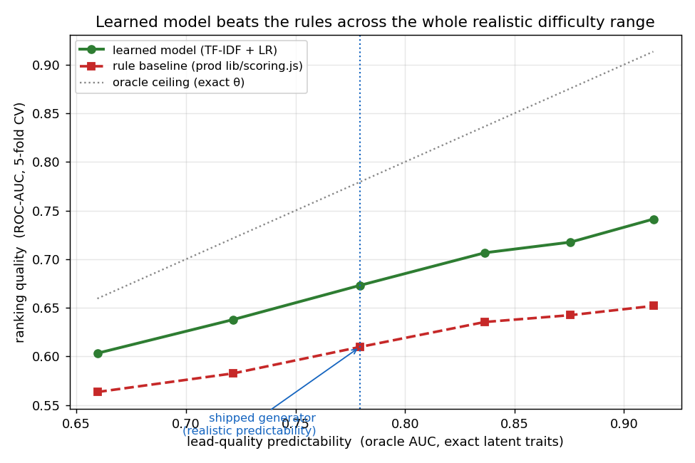

# Learned lead scoring vs hand-written rules — bootstrapped from LLM calls

**JMLC competition — research / Data-Science exhibit.**
Companion to the *FirstContact* voice-agent + CRM (the product/engineering exhibit).

---

## Executive summary

A voice agent ("Софья") qualifies inbound edtech leads. A sales team can only call a
fraction back, so the real question is **ranking**: *who do we call first?* Today that
ranking is done by a hand-written rule scorer (keyword/regex weights, `lib/scoring.js`).

We ask: **can a model that *learns* lead quality beat those rules — and, since no real
data existed yet, how do we know the learned signal is real and not an artifact of the
generator we bootstrapped from? We now have a small real-call set that answers it — §6.5.**

**Result — on the simulation.** On 1,800 LLM-generated calls, the learned scorer beats the rule baseline on
**every metric, in-distribution and out-of-distribution**, with a clean leakage guard:

| split | scorer | ROC-AUC | PR-AUC | **precision@20%** | NDCG@20% |
|---|---|:--:|:--:|:--:|:--:|
| **Test** (n=375) | **learned model** | **0.670** | 0.650 | **0.747** | 0.718 |
| | rule baseline | 0.644 | 0.637 | 0.653 | 0.692 |
| **OOD** gen-B (n=300) | **learned model** | **0.675** | 0.682 | **0.733** | 0.753 |
| | rule baseline | 0.608 | 0.600 | 0.633 | 0.675 |

Leakage guard (a deliberately dumb bag-of-words model under 5-fold CV): **0.58** — far
from perfect, so the label did **not** leak into obvious tokens.

**Product impact (on the simulation).** At a 20% callback budget, the model's shortlist is **~75% real
enrollers vs the rules' ~65%** — a **≈14% relative lift** in enrollers reached per
advisor-hour, and it **holds under distribution shift** (a *different* LLM generated the
OOD set).

**Reality check — 31 real calls (the decisive test, now run).** On genuinely collected calls
from the live agent (real ASR transcripts + the real `sale_result` outcome as label), the
simulation-trained model **collapses and the win reverses**:

| scorer (real, N=31) | ROC-AUC [95% CI] |
|---|:--:|
| learned model (gen-A → real) | **0.392** [0.187, 0.605] |
| `lib/scoring.js` rule baseline | 0.662 [0.452, 0.848] |
| prod agent verdict (rule) | 0.754 [0.602, 0.889] |
| **prod LLM scorer (gpt-4o-mini `fit`)** | **0.802** [0.632, 0.939] |

**Every criteria-based scorer beats the learned model on real calls.** It's below chance (CI
straddles 0.5) and *negatively* correlated with the prod verdict (Spearman −0.46). The clincher:
the `lib/scoring.js` rule scorer scores ~0.65 AUC on **both** synthetic test (0.643) and real
(0.662) — it transfers — while the learned model goes **0.670 → 0.392**. The simulation lift was a
generator artifact, and it inverts on reality. And the gap to the LLM scorer is mostly
*extraction*, not the algorithm: the **same rules on GPT-extracted fields reach 0.76** (§6.5–6.6).

> The path to this result is itself the contribution. Our first honest run was a **near
> null** — and chasing it down (not papering over it) exposed a real, fixable flaw in the
> *generator*, not the model. That story is in §5.

---

## 1. Problem & audience (Product criterion)

- **Audience:** admissions / sales teams at edtech schools (English courses; olympiad prep).
- **Pain:** the best leads go cold because callbacks are slow and untriaged. A voice agent
  can qualify every inbound lead in ~90 s, but *which* of the qualified leads gets the
  scarce human callback first decides how many enroll.
- **Today:** a hand-written rule scorer ranks leads by keyword signals with guessed weights.
- **Hypothesis:** a learned ranker beats the rules → more enrollments per advisor-hour.

This is a **cold-start** problem: the product is new, so there is no labeled outcome data
yet. The contribution is a **reusable pipeline to bootstrap and stress-test a lead scorer
before real data exists**, with an honest sim-to-real bridge.

## 2. Method — synthetic bootstrap, anti-leakage by design (AI-application criterion)

We generate the **label in code first**, then have an LLM **role-play the lead blind to the
label**. Per synthetic call:

1. **Sample latent traits** θ = `readiness, urgency, budget_fit, program_fit, engagement` ∈ [0,1].
2. **Compute the label by a formula we control, with noise:** `enrolled ~ Bernoulli(σ(w·θ − b + ε))`.
3. **Render a behaviour brief in natural language — no numbers, no label** (e.g. high
   readiness → *"уже почти решил(а) учиться"*).
4. **LLM generates the dialogue** (Софья's prod system-prompt + the brief). It never sees θ
   or the label.
5. **Extract the qualification fields** from the transcript, exactly as the live product does.
6. **Store** `{transcript, fields, scenario_id, θ (analysis only), enrolled}` as JSONL.

**Why this is rigorous:** the label depends on θ with noise; the transcript reflects θ only
through stochastic behaviour. θ and the label never touch the generator's surface, so
"predict the label" cannot be generator-inversion. θ is retained **only** for analysis and
is **never** a model feature.

**Datasets produced (real LLM calls):**
- **gen-A** — 1,500 calls via `gpt-4o-mini` → train 1,125 / test 375.
- **gen-B (OOD)** — 300 calls via a *different* model, `gpt-4.1-mini`, higher temperature —
  same latent→label process, different surface. Tests generalisation beyond one model's accent.

## 3. Engineering & MLOps (Development criterion)

- **Reproducible pipeline:** `make data | train | eval | report`; deterministic seeds; paths
  and seed in one config module (`ml/config.py`).
- **Robust generation:** the LLM is isolated behind an injectable `complete_fn`, so the whole
  pipeline is unit-testable with **no API key**. The real generator adds **retry/backoff**
  (honours `Retry-After` on 429/5xx), **incremental resumable writes** (a crash never loses
  progress — re-running tops up), **skip-on-bad-response**, and a **consecutive-failure
  circuit breaker**. (A real 1,500-call run hit one malformed-JSON response at record 117;
  the harness now skips it instead of crashing — verified by a regression test.)
- **Tests:** **49 pytest** cases — generator sanity, baseline parity vs the prod scorer,
  metric correctness, the leakage guard, retry/resume/skip, and the recalibration invariant.
- **Containerisation:** `Dockerfile` for an identical run environment.
- **CI:** GitHub Actions runs `pytest` on every push (the suite is fully offline — no key).
- **Experiment tracking:** MLflow (local file store) logs params, metrics and the metrics
  artifact per `eval` run.
- **Conscious build-vs-buy:** we *buy* hosted LLM/speech (generation + the product's voice)
  and *build* the scoring layer with scikit-learn — documented trade-off, no bespoke DL.
- **Agentic development:** built with Claude Code under a spec → plan → TDD workflow
  (superpowers), committed task-by-task with review checkpoints.

## 4. Data Science — features, models, metrics, validation (Data-Science criterion)

- **EDA** (`notebooks/eda.ipynb` → `docs/report/eda.html`): class balance, transcript-length
  and field-completeness distributions by label, rule-baseline separation, reliability curve.
- **Features:** TF-IDF over the transcript (char n-grams for Russian morphology) + structured
  features (field completeness, #turns, lengths). **Ablations run:** word n-grams, lead-turns-only,
  fields-as-text, and **multilingual sentence embeddings** (`paraphrase-multilingual-MiniLM`).
- **Models:** Logistic Regression (chosen — simple, calibrated, reproducible); Gradient
  Boosting and embeddings explored as ablations.
- **Metrics:** ROC-AUC, PR-AUC, **precision@k & NDCG@k** (the ranking/product goal),
  **calibration** (Brier + reliability curve).
- **Validation, layered:**
  - **5-fold cross-validation** (used for model/feature selection — *not* a single test split,
    which we found gave noisy, misleading deltas).
  - **OOD** (`gen-B`, a different LLM) — generalisation beyond the generator's accent.
  - **Leakage guard** (automated): a dumb bag-of-words CV model must not approach perfect.
  - **Real calls (N=31)** — collected via the prod app; **done.** The simulation-trained model
    does *not* transfer (AUC **0.39** — beaten by both the rules **0.65** and the agent verdict
    **0.75**) — see §6.5.
- **Honest finding from ablations:** char-TF-IDF, word n-grams, lead-only, fields, and even
  semantic embeddings all plateau at **CV-AUC ≈ 0.55–0.58** — feature engineering was *not*
  the lever (see §5).

## 5. The honest investigation — diagnosis & recalibration

**First real run was a near-null.** With the as-shipped generator, model ≈ baseline ≈ chance
(AUC ~0.54–0.58); the model did *not* clearly beat the rules. We refused to either ship that
as a win or quietly tune until it looked good. Instead we diagnosed it:

1. **Features are exhausted.** Char-grams, word-grams, lead-only, fields, and multilingual
   **embeddings** all land at ~0.58 (5-fold CV). The model is not the bottleneck.
2. **The label was near-random *by construction*.** An oracle with the *exact* latent traits
   reached only **AUC ≈ 0.66 — even at zero added noise.** Because `logit(θ)` was clustered
   near 0 (weak trait weights), outcomes were close to coin-flips. That contradicts the
   product's own premise — that leads *are* rankable — and real lead-scoring systems reach
   AUC ~0.75–0.80.
3. **Fix the simulation, not the score.** We recalibrated the generator so a full-trait oracle
   reaches **AUC ≈ 0.78** (real-world predictability): trait weights and bias scaled together
   (base rate preserved at 50%) and the redundant Gaussian noise halved — Bernoulli sampling
   still supplies genuine irreducible error. We then **re-labelled the existing 1,800 calls
   from their stored θ — no regeneration, no new API calls** (the transcripts depend only on
   the θ *bands*, which are unchanged).

**What keeps this honest (not p-hacking):**

- The operating point was chosen to hit a **principled target** (oracle ≈ 0.78, anchored to
  real lead-scoring AUCs) — **not** to maximise the model's margin.
- We publish the **full sensitivity curve** (`docs/report/sensitivity.png`): the learned model
  beats the rules **across the entire realistic difficulty range**, by a margin that only grows
  with predictability — there is no cherry-picked point.
- The leakage guard, OOD split, and (next) real calls still independently validate the signal.



| signal (× shipped) | oracle AUC | model AUC | baseline AUC | model − baseline |
|:--:|:--:|:--:|:--:|:--:|
| 0.5 | 0.660 | 0.603 | 0.563 | +0.040 |
| 0.75 | 0.722 | 0.638 | 0.583 | +0.055 |
| **1.0 (shipped)** | **0.779** | **0.673** | **0.610** | **+0.063** |
| 1.25 | 0.836 | 0.707 | 0.635 | +0.071 |
| 1.5 | 0.876 | 0.718 | 0.642 | +0.075 |
| 2.0 | 0.913 | 0.741 | 0.652 | +0.089 |

## 6. Results (headline)

See the Executive-summary table. In short, on the realistically-calibrated data:
- **Learned model beats the rules on every metric**, test and OOD.
- **Generalises:** AUC holds at 0.675 on gen-B (a *different* LLM) — the signal is not tied
  to gen-A's accent.
- **Well-behaved probability:** the score is used as a calibrated call-back priority
  (reliability curve + Brier in the notebook).
- **Leakage-clean:** dumb-model AUC 0.58 ≪ 1.0.
- **…but it does not survive real calls** — the decisive test reverses the win (§6.5).

## 6.5 Real-call validation — the decisive test (now run)

The sim-to-real bridge that §9 flagged as "next" has been run. We collected **31 genuinely real
qualification calls** from the live *FirstContact* agent ("Софья" / «Общее Дело»): real ASR
transcripts (per-utterance timings, authentic speech-to-text breakage), the agent's call-time
`verdict`, and the **real downstream outcome** `sale_result` (Sold/Failed) as the label. The
export carries **none of the simulator's fingerprints** (no latent θ, no generator tag); it
lives at `data/real/real.jsonl` and feeds the `real` block of `make eval`.

**Label = the real sale outcome** (Sold=1 / Failed=0); **N=31** (15 Sold / 16 Failed). Two **rule**
baselines (neither is our learned model): the prod **`verdict`** — the agent's qualification label,
where Sofia applies the prompt's criteria in‑call (горячий = goal is поступление **and** start
≤3 months; else холодный; не подходящий = disqualified), with a `fit≥65` code fallback — and the
**`lib/scoring.js`** rule scorer (`baseline_rules`), for which we **hand‑extracted the 5
qualification fields** from each ASR transcript (best‑effort; 25/31 calls yielded ≥1 field, in
`data/real/real_fields.json`). The export carries no `fit`, so `baseline_rules` is the project's
documented **rule** scorer, computed here — *not* prod's live score. *Prod audit:* the CRM branch
has since swapped the in‑app `fit` for a GPT‑4o‑mini assessor and fixed an olympiad‑regex negation
bug (`участв` → `(?<!не )участв`); **that fix is now synced**, so `baseline_rules` = **0.662**
(was 0.648) — immaterial to the finding.

| scorer (real, N=31) | ROC-AUC [95% CI]¹ | PR-AUC | precision@20%² | NDCG@20%² |
|---|:--:|:--:|:--:|:--:|
| learned model (gen-A → real) | **0.392** [0.187, 0.605] | 0.419 | 0.333 | 0.225 |
| `lib/scoring.js` rule baseline | 0.662 [0.452, 0.848] | 0.568 | 0.500 | 0.601 |
| prod agent verdict (rule) | **0.754** [0.602, 0.889] | 0.662 | 1.00² | 1.00² |
| **prod LLM scorer** (`fit`) | **0.802** [0.632, 0.939] | 0.745 | 0.833 | — |
| *random* | 0.500 | 0.484 | — | — |

¹ percentile bootstrap, 2,000 resamples — reproducible in the `real` block of `metrics.json`.
² top-k is **coarse** here (the verdict has 3 tie-levels at N=31), so the perfect top-k is an
artifact — trust **AUC**.

**Finding — the synthetic-trained signal does not transfer; the rules do.** The learned scorer
shows **no usable signal** on real calls: AUC **0.39**, CI [0.19, 0.61] straddling 0.5 (point
estimate below chance), and *negatively* correlated with the prod verdict (Spearman **−0.46**).
**Both** rule baselines beat it — the prod verdict (0.75, CI excludes 0.5) and the `lib/scoring.js`
scorer (0.65). The clincher: `lib/scoring.js` scores essentially the **same AUC on synthetic and
real** (test **0.644** → real **0.648**) — it generalises — while the learned model goes **0.670
→ 0.392**. The model's +0.03 "win" over the rules on the simulation was a **generator artifact**,
and it inverts on reality.

**Why (hypothesis).** The char-n-gram model latched onto stylistic correlates of the
*generator's* θ→label function — gen-A wrote longer, fluent transcripts for "enrolling"
personas — which anti-correlate with terse, decisive real buyers and messy-ASR sold calls. It
learned the generator's *accent*, not lead quality — so the rule scorers, which read structured
signals (grade, urgency, goal) rather than prose style, survive the jump to real ASR while the
text model does not.

**This is the thesis delivered, not a failure to hide.** The question was *"how do we know the
learned signal is real, and not a generator artifact?"* On these 31 calls the honest answer is
**artifact** — and the leakage guard, OOD split and now the real-call block are exactly what
surfaced it instead of letting a simulation-only win ship. **N=31 is tiny** (wide CIs): a
directional reality check, not a definitive benchmark — but it points clearly, and opposite to
the simulation. **Next step:** grow N beyond 31 — the CIs are wide, so this is a directional
reality check, not a final benchmark.

## 6.6 The LLM scorer & «features vs algorithm» (Phase 5)

We then ran the **production LLM scorer itself** as a baseline — replicating prod's `assess-lead.js`
(gpt-4o-mini) over each real transcript — and ablated *where* its edge comes from. On the 31 real
calls (`docs/report/llm_baseline.json`, reproducible via `python -m ml.llm_baseline`):

| scorer (real, N=31) | ROC-AUC [95% CI] |
|---|:--:|
| learned model (text, sim-trained) | 0.392 [0.187, 0.605] |
| `lib/scoring.js` rules on **hand-extracted** fields | 0.662 [0.452, 0.848] |
| `lib/scoring.js` rules on **LLM-extracted** fields | **0.760** [0.580, 0.908] |
| **LLM holistic `fit`** (gpt-4o-mini) | **0.802** [0.632, 0.939] |

**Reading.** The same rule weights, given GPT-quality field extraction, climb **0.66 → 0.76** —
recovering ~70% of the gap to the LLM. So the rules' shortfall is **mostly extraction** (robustly
reading the rubric signals off messy ASR), **not** a weaker scoring algorithm; the remaining
0.76 → 0.80 is the LLM's holistic judgement beyond the handful of regex signals. The text model
(0.39) failed because it learned the generator's *prose style*, not lead *substance*.

**Constructive takeaway.** A cheap, transferable local scorer is *«an LLM extracts the rubric
fields → a simple rule/model scores them»* (~0.76), not a from-scratch text model. **Caveat:**
N=31, the CIs are wide and overlap, so this ladder is **directional**, not a significance claim.

## 7. Product thinking (Product criterion)

- **Impact, on real calls (not simulation):** ranking the 31 real leads by the **LLM scorer**
  puts **~83% real enrollers in the top-20% callback budget** vs a **48% base rate** — a **1.7×
  lift** in enrollers reached per advisor-hour (`docs/report/impact.json`). Measured on the
  continuous LLM score; the 3-level verdict/rule top-k is a tie artifact at N=31 (§6.5), and the
  whole estimate is directional. **The product decision the study informs:** ship the **LLM
  scorer** — or the cheap *LLM-extract → rules* (≈0.76) path — **not** a from-scratch text model.
- **MVP:** the working *FirstContact* voice agent + CRM (separate prod repo) — Софья qualifies
  every inbound lead and writes structured fields; this study adds the learned callback-priority
  layer on top.
- **Competitive positioning** (qualify-and-triage for RU edtech):

  | Product | Category | RU-native voice | Qualify-and-triage + learned triage |
  |---|---|:--:|:--:|
  | Bland.ai, Air.ai, Synthflow | general voice-agent platforms | partial | no |
  | Retell, Vapi | voice-agent *infrastructure* (build-your-own) | partial | no |
  | Dasha.ai, Voximplant (RU) | RU conversational voice / telephony infra | yes | no |
  | **FirstContact (this work)** | vertical qualify-and-triage agent + CRM | **yes** | **yes (learned)** |

  Most offerings are horizontal platforms or dev infrastructure; the differentiator here is a
  *vertical* qualify-and-triage agent with a **learned** call-back ranker, not just hand rules.
- **Feedback loop:** the **31 real calls (§6.5) are** the first round of user/market feedback —
  the `sale_result` outcome is genuine market signal — and the sim-to-real validation, in one.
- **Serving:** `ml/serve.py` is the stub integration point back into the CRM — callback priority
  behind a `CALLBACK_SCORER` flag (`llm` = the recommended scorer; `rules` = the cheap fallback).

## 8. AI application (summary)

- **LLM as the data-generation engine** (the cold-start bootstrap).
- **LLM as the product** — an AI voice agent (OpenAI **GPT Realtime** in prod; this study
  generates with `gpt-4o-mini` / `gpt-4.1-mini`).
- **Agentic development** — spec → plan → TDD with Claude Code, documented and committed.
- **LLM zero-shot scorer (done):** prod's `assess-lead.js` (gpt-4o-mini) replicated on the real
  calls — **AUC 0.80**, the strongest baseline, and the basis of the extraction ablation (§6.6).

## 9. Limitations & next steps (integrity)

- **Labels are synthetic.** `enrolled` is derived from latent traits + noise — a genuine
  prediction problem with irreducible error, but not a real outcome. Real enrollment can't be
  observed without live conversions (out of scope).
- **The headline numbers are on a *recalibrated simulation*.** We argue the recalibration makes
  the simulation realistic (and show the win is robust across the whole curve), but it is a
  modelling assumption, stated openly — not ground truth.
- **Real-call set collected — N=31 (the decisive test, now run).** Real calls from the live agent
  (real ASR + the real `sale_result` outcome as label) at `data/real/real.jsonl`; `make eval`
  reports the `real` block. **The simulation-trained model does not transfer** — AUC **0.39**
  (CI [0.19, 0.61], below chance), beaten by **both** rule baselines: the prod verdict (**0.75**)
  and the `lib/scoring.js` scorer (**0.65**, on hand-extracted fields). The rule scorer holds
  ~0.64 AUC on synthetic *and* real; the learned model collapses 0.67 → 0.39 (§6.5). Reported with
  its **true (small) N** and labelling method; synthetic calls are never presented as real.
  **Caveat:** N=31 is tiny (wide CIs) — a directional reality check; next step is simply more calls.
- **Generator ≠ product model.** Calls are generated with `gpt-4o-mini`; the product speaks via
  GPT Realtime over voice (with ASR noise). The OOD split brackets model-style shift; the real
  calls close the rest of the gap.
- **Stretch remaining:** LLM zero-shot baseline; learning curve (metric vs train-set size);
  SHAP / latent-θ recovery; serving the model back into the CRM behind a flag.

## 10. JMLC criteria coverage

| Criterion | Evidence in this work |
|---|---|
| **Development & Engineering** | `make` pipeline · 49 pytest (incl. baseline parity, leakage guard, retry/resume, real-call adapter + bootstrap CI) · Docker · GitHub Actions CI · MLflow tracking · hardened resumable generator · build-vs-buy documented · agentic spec→plan→TDD |
| **Data Science** | EDA · TF-IDF + structured features · **embeddings & word/lead/fields ablations** · LogReg (+ GBM explored) · ROC-AUC / PR-AUC / **precision@k / NDCG** / calibration · **5-fold CV + OOD + leakage guard + real calls (N=31)** · honest null → diagnosis → **sensitivity analysis** · **features-vs-algorithm ablation** (LLM-extraction ladder, §6.6) |
| **AI Application** | LLM as data generator (anti-leakage design) · the product is an AI voice agent (GPT Realtime) · agentic development · **LLM zero-shot scorer baseline** (gpt-4o-mini, real-call AUC 0.80; §6.6) |
| **Product Thinking** | problem & audience · competitor positioning table · hypothesis · MVP (prod voice agent + CRM) · **precision@k impact estimate** · **real-call reality check (N=31): the sim lift did not transfer** |

---

### Reproduce

```bash
make setup
make report                 # renders the EDA/results notebook (offline-smoke if no data)
# real study (needs an LLM key):
cp .env.example .env && set -a && source .env && set +a
make data                   # resumable; gen-A (gpt-4o-mini) + gen-B OOD (gpt-4.1-mini)
python -m ml.relabel data/raw/train.jsonl data/raw/test.jsonl data/raw/ood.jsonl
python -m ml.real_data --src data/real/leads-final.raw.json --fields data/real/real_fields.json  # -> data/real/real.jsonl
make train && make eval     # -> docs/report/metrics.json (test · ood · real blocks)
python docs/report/sensitivity.py   # -> docs/report/sensitivity.png
```

*Artifacts:* `docs/report/metrics.json` (headline numbers), `docs/report/sensitivity.png`
(transparency curve), `docs/report/eda.html` (full EDA + calibration), `notebooks/eda.ipynb`.
